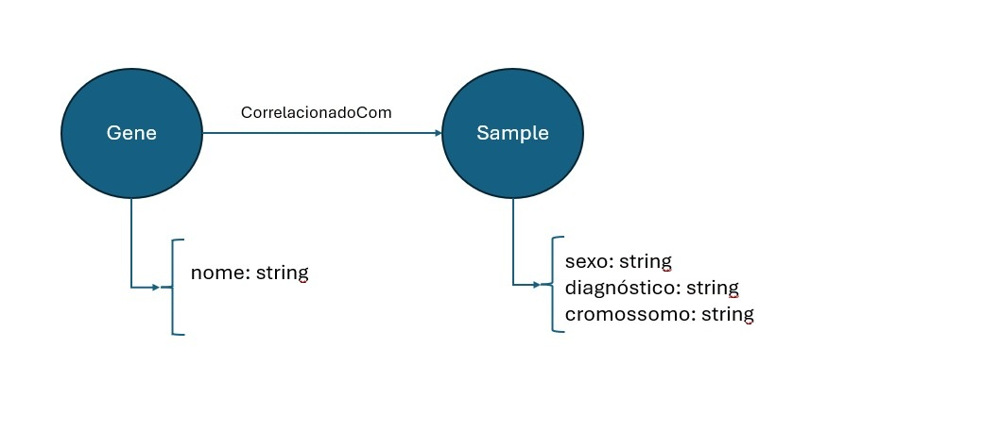

# P2 - Segunda Entrega

2025.2 Ciência e Visualização de Dados em Saúde

# Projeto: Redes transcriptômicas relacionadas ao autismo: diferenças sexuais e de desenvolvimento no cérebro humano
# Project: Transcriptomic networks related to autism: sex and developmental differences in the human brain

# Descrição Resumida do Projeto

O projeto tem como objetivo identificar módulos de co-expressão gênica que contenham lncRNAs (RNA longos que não codificam proteínas mas tem papel fundamental no controle da expressão de genes) e genes de risco para TEA (Transtorno do Espectro Autista), observando se há diferenças na forma como eles se comportam em cérebros de indivíduos com diagnóstico de TEA de sexos diferentes. Para tanto, será dado enfoque especial em genes regulados por hormônios sexuais (AR – receptor androgênico, ESR1/2 – receptores de estrogênio, etc.), visando identificar se a expressão gênica e a conectividade de módulos co-expressos podem apresentar padrões sex-específicos que ajudariam a explicar a maior prevalência de autismo em meninos e possíveis mecanismos regulatórios protetores em meninas.

# Slides

[Redes transcriptômicas relacionadas ao autismo: diferenças sexuais e de desenvolvimento no cérebro humano](https://docs.google.com/presentation/d/1rD8ppr5kKH31b6UyzmA64c5jl3uJMtOS/edit?slide=id.p11#slide=id.p11)

# Fundamentação Teórica

- Apesar de haver uma  maior taxa de diagnóstico do TEA em homens do que em mulheres, há uma quantidade surpreendentemente pequena de pesquisas focadas nas razões para essa disparidade (Halladay et al., 2015). Em específico investigar diferenças sexuais no TEA pode ajudar na compreensão da  sintomatologia, opções e resposta a tratamentos (Napolitano et al. , 2022).

- Estudos de transcriptoma do cérebro em desenvolvimento demonstram que genes de risco para TEA e lncRNAs tendem a se organizar em módulos de co-expressão específicos, muitos dos quais têm expressão restrita a janelas temporais críticas, como o período pré-natal e início pós-natal, quando ocorre a formação de circuitos neurais essenciais (Willsey et al., 2013).

- A análise de diferenças sexuais em co-expressão permite investigar possíveis mecanismos de proteção em meninas ou maior suscetibilidade em meninos, servindo como proxy da influência hormonal (Lin L, et al. 2019).

# Perguntas de Pesquisa

1. É possível identificar genes “hubs” e módulos de expressão que diferenciam amostras de neurodivergentes femininos e masculinos? É possível ampliar o escopo de comparação entre neurodivergentes e neurotípicos?

2. A expressão destes genes centrais, se relaciona com a co-expressão de genes de hormonas sexuais regulados pelo eixo hipotálamo-hipófise de maneira diferencial?

3. Os genes “hubs” identificados aqui  já foram previamente associados ao TEA?

4. Existe correlação entre os genes “hubs” identificados e a localização cromossomal em X e Y?

5. Existe correlação entre os genes “hubs” identificados no cérebro e genes “hubs” identificados no sangue? É possível propô-los como biomarcadores?

# Metodologia

## Escolha dos dados

- Como fonte principal de dados, foi escolhido o dataset do GEO [GSE102741](https://www.ncbi.nlm.nih.gov/geo/query/acc.cgi?acc=GSE102741&utm), contendo dados públicos de RNA-seq com normalização RPKM, extraídos de amostras do Cortex prefrontal dorsolateral do cérebro humano, para os grupos TEA e controle. Além disso, metadados sobre idade e sexo estão disponíveis no dataset

- Outro dataset selecionado foi o [E-MTAB-13871](https://www.omicsdi.org/dataset/biostudies-arrayexpress/E-MTAB-13871) do ArrayExpress, contendo amostras de sangue de humanos controle e com TEA, extraindo RNA-seq de mRNA com normalização binomial negativa por células mononucleares do sangue periférico, e metadados de idade e sexo.

## Processamento do dataset GSE102741

- Para a análise, as amostras foram filtradas por critério de idade, mantendo apenas as relacionadas à indivíduos adultos, com mais de 18 anos, para o sexo masculino e feminino.

- A filtragem inicial foi realizada por meio da ferramenta [Orange](https://orangedatamining.com/), obtendo, para o estudo, 18 amostras controle (3 do sexo feminino e 15 do sexo masculino) e 6 amostras relacionadas ao TEA (1 do sexo feminio e 5 do sexo masculino).

- Foi calculada a média de log2 RPKM para ambos os grupos, com a ferramenta [GraphPad Prism](https://www.graphpad.com/features)

- No [Orange](https://orangedatamining.com/), foi filtrado os genes ruidosos e de baixa expressão. A figura abaixo mostra o workflow da pipeline até esta etapa.

- Para a análise de expressão diferencial, foram separados genes diferencialmente expressos em comum para os grupos TEA e controle, e genes diferencialmente expressos somente para o grupo TEA, como mostra o workflow abaixo.

- Foram obtidos 4 grupos de análise:
    - Genes exclusivamente abundantes em grupos TEA (masculino e feminino)
    - Genes exclusivamente abundantes entre grupos específicos (TEA e Controle)
    - Genes diferencialmente expressos entre grupos com TEA (masculino e feminino)
    - Genes diferencialmente expressos entre todos os grupos (TEA e Controle)

## Análise do dataset GSE102741

- Para a representação dos dados em grafos, foi utilizada a ferramenta [Cytoscape](https://cytoscape.org/), com objetivo de visualizar os genes com maior abundância em indivíduos com TEA e entre ambos os grupos de análise (TEA e controle).

- A base [SFARI gene](https://gene.sfari.org/) foi utilizada como referência sobre genes relacionados ao autismo.

- As ferramentas [Genome Browser](https://genome.ucsc.edu/) e [GeneLoc](https://geneloc.weizmann.ac.il//index.shtml) foram utilizadas para a anotação de idiogramas.

- Foi realizada, também, uma análise de enriquecimento por meio da ferramentas [Enrichr](https://maayanlab.cloud/Enrichr/) e [David Bioinformatics](https://davidbioinformatics.nih.gov/), com objetivo de determinar os perfis funcionais, de localização e processuais exclusivos para os genes diferencialmente expressos associados ao TEA em indivíduos femininos e masculinos, identificando assim a divergência molecular por sexo.

- Os genes associados ao TEA, exclusivos femininos e exclusivos masculinos, obtidos nas etapas anteriores, foram submetidos ao [Enrichr](https://maayanlab.cloud/Enrichr/) para o teste de super-representação

- Para a análise e enriquecimento, a pesquisa foi focada nas três categorias principais da Gene Ontology (GO), utilizando a biblioteca mais recente para a espécie em estudo:
   - **GO Biological Process (BP)**: Processos e vias biológicas.
   - **GO Cellular Component (CC)**: Localização e estruturas celulares.
   - **GO Molecular Function (MF)**: Funções e atividades moleculares elementares.

# Bases de Dados e Evolução

| Base de Dados  | Endereço na Web    | Resumo descritivo |
|-------|--------|----------------|
| GSE 102741 | https://www.ncbi.nlm.nih.gov/geo/query/acc.cgi?acc=GSE102741&utm| Dados públicos de RNA-seq com normalização RPKM, extraídos de amostras do Cortex prefrontal dorsolateral do cérebro humano, para os grupos TEA e controle e metadados sobre idade e sexo. |
| E-MTAB-13871 | https://www.omicsdi.org/dataset/biostudies-arrayexpress/E-MTAB-13871 | Dados do ArrayExpress, contendo amostras de sangue de humanos controle e com TEA, extraindo RNA-seq de mRNA com normalização binomial negativa por células mononucleares do sangue periférico, e metadados de idade e sexo. |

- Sobre a base [GSE102741](https://www.ncbi.nlm.nih.gov/geo/query/acc.cgi?acc=GSE102741&utm), foram feitos tratamentos de filtragem por idade, separando para as análises somente indivíduos com mais de 18 anos, foi calculada a média de log2 RPKM, e removidos genes com baixa expressão ou com ruído, com média de log2 RPKM menor que 0,5.

- Percebeu-se nesta base um certo desbalanceamento entre as classes após os tratamentos, com 18 amostras controle (3 do sexo feminino e 15 do sexo masculino) e 6 amostras relacionadas ao TEA (1 do sexo feminio e 5 do sexo masculino).

# Modelo Lógico

- O grafo pode ser organizado em camadas, incluindo: genes codificadores, lncRNAs, elementos epigenéticos (picos/DMRs) e anotação de genes de risco. 

- As arestas podem representar a co-expressão entre genes/lncRNAs ou relações com elementos epigenéticos. 

- Cada nó pode ter atributos como expressão média por sexo, pertencimento a genes de risco e detectabilidade em tecidos periféricos. 

# Integração entre Bases

- Até o momento, não foram realizadas integrações entre bases.

# Análise Preliminar

- Para o grupo com TEA

- Para os grupos TEA e Controle

# Ferramentas

- [Orange](https://orangedatamining.com/)
- [GraphPad Prism](https://www.graphpad.com/features)
- [Cytoscape](https://cytoscape.org/)
- [SFARI gene](https://gene.sfari.org/)
- [Genome Browser](https://genome.ucsc.edu/)
- [GeneLoc](https://geneloc.weizmann.ac.il//index.shtml)
- [Enrichr](https://maayanlab.cloud/Enrichr/)
- [David Bioinformatics](https://davidbioinformatics.nih.gov/)

# Referências Bibliográficas

- Gupta, A., & Bhat, A. (2019). Sex differences in autism spectrum disorder: Diagnostic, neurobiological and clinical aspects. Frontiers in Psychiatry, 10, 607. https://doi.org/10.3389/fpsyt.2019.00607

- Halladay, A. K., Bishop, S. L., Constantino, J. N., Daniels, A. M., Koenig, K., Palmer, K., Messinger, D., Pelphrey, K., Sanders, S. J., Singer, A. T., Taylor, J. L., & Szatmari, P. (2015). Sex and gender differences in autism spectrum disorder: summarizing evidence gaps and identifying emerging areas of priority. Molecular Autism, 6, 36. https://doi.org/10.1186/s13229-015-0019-y

- Lin L, et al. Integrated Analysis of Brain Transcriptome Reveals Convergent Molecular Pathways in Autism Spectrum Disorder. Front Psychiatry. 2019;10:706.
Napolitano, L., Ferri, R., & Di Filippo, G. (2022). Sex differences in autism spectrum disorder: diagnostic, neurobiological and clinical aspects. Frontiers in Psychiatry, 13, 889636. https://doi.org/10.3389/fpsyt.2022.889636 

- Voineagu, I., et al. (2011). Transcriptomic analysis of autistic brain reveals convergent molecular pathology. Nature, 474(7351), 380–384. https://doi.org/10.1038/nature10110 

- Willsey AJ, et al. Coexpression networks implicate human midfetal deep cortical projection neurons in the pathogenesis of autism. Cell. 2013;155(5):997–1007. PMID: 24138891 

- AMERICAN PSYCHIATRIC ASSOCIATION. Manual diagnóstico e estatístico de transtornos mentais: DSM-5. 5. ed. Porto Alegre: Artmed, 2014.

