# P3 - Terceira Entrega

2025.2 Ciência e Visualização de Dados em Saúde

# Projeto: Redes transcriptômicas relacionadas ao autismo: diferenças sexuais e de desenvolvimento no cérebro humano
# Project: Transcriptomic networks related to autism: sex and developmental differences in the human brain

# Descrição Resumida do Projeto

O projeto tem como objetivo identificar módulos de co-expressão gênica que contenham lncRNAs (RNA longos que não codificam proteínas mas tem papel fundamental no controle da expressão de genes) e genes de risco para TEA (Transtorno do Espectro Autista), observando se há diferenças na forma como eles se comportam em cérebros de indivíduos com diagnóstico de TEA de sexos diferentes. Para tanto, será dado enfoque especial em genes regulados por hormônios sexuais (AR – receptor androgênico, ESR1/2 – receptores de estrogênio, etc.), visando identificar se a expressão gênica e a conectividade de módulos co-expressos podem apresentar padrões sex-específicos que ajudariam a explicar a maior prevalência de autismo em meninos e possíveis mecanismos regulatórios protetores em meninas.

# Slides

[Redes transcriptômicas para estudo das diferenças de expressão gênica sexo-específicas no Transtorno do Espectro Autista (TEA)](https://docs.google.com/presentation/d/1V4jU9-_xXqlAjIQOqwQ8WGE6kgRY32t2/edit?slide=id.p1#slide=id.p1)

# Fundamentação Teórica

- Apesar de haver uma  maior taxa de diagnóstico do TEA em homens do que em mulheres, há uma quantidade surpreendentemente pequena de pesquisas focadas nas razões para essa disparidade (Halladay et al., 2015). Em específico investigar diferenças sexuais no TEA pode ajudar na compreensão da  sintomatologia, opções e resposta a tratamentos (Napolitano et al. , 2022).

- Estudos de transcriptoma do cérebro em desenvolvimento demonstram que genes de risco para TEA e lncRNAs tendem a se organizar em módulos de co-expressão específicos, muitos dos quais têm expressão restrita a janelas temporais críticas, como o período pré-natal e início pós-natal, quando ocorre a formação de circuitos neurais essenciais (Willsey et al., 2013).

- A análise de diferenças sexuais em co-expressão permite investigar possíveis mecanismos de proteção em meninas ou maior suscetibilidade em meninos, servindo como proxy da influência hormonal (Lin L, et al. 2019).

# Perguntas de Pesquisa

1. É possível identificar genes “hubs” e módulos de expressão que diferenciam amostras de neurodivergentes femininos e masculinos? É possível ampliar o escopo de comparação entre neurodivergentes e neurotípicos?

2. A expressão destes genes centrais, se relaciona com a co-expressão de genes de hormonas sexuais regulados pelo eixo hipotálamo-hipófise de maneira diferencial?

3. Os genes “hubs” identificados aqui  já foram previamente associados ao TEA?

4. Existe correlação entre os genes “hubs” identificados e a localização cromossomal em X e Y?

5. Existe correlação entre os genes “hubs” identificados no cérebro e genes “hubs” identificados no sangue? É possível propô-los como biomarcadores?

# Metodologia

## Bases de Dados e Evolução

- Foi escolhido, primeiramente, o dataset do GEO [GSE102741](https://www.ncbi.nlm.nih.gov/geo/query/acc.cgi?acc=GSE102741&utm), contendo dados públicos de RNA-seq com normalização RPKM, extraídos de amostras do Cortex prefrontal dorsolateral do cérebro humano, para os grupos TEA e controle. Além disso, metadados sobre idade e sexo estão disponíveis no dataset

- Foi selecionado, também, o [E-MTAB-13871](https://www.omicsdi.org/dataset/biostudies-arrayexpress/E-MTAB-13871) do ArrayExpress, contendo amostras de sangue de humanos controle e com TEA, extraindo RNA-seq de mRNA com normalização binomial negativa por células mononucleares do sangue periférico, e metadados de idade e sexo.

- Além disso, de forma a enriquecer as análises com maior disponibilidade de dados, foram incluidos os datasets [GSE28521](https://www.ncbi.nlm.nih.gov/geo/query/acc.cgi?acc=GSE28521) (cérebro) e [GSE18123](https://www.ncbi.nlm.nih.gov/geo/query/acc.cgi?acc=gse18123) (sangue).

| Base de Dados  | Endereço na Web    | Resumo descritivo |
|-------|--------|----------------|
| GSE 102741 | https://www.ncbi.nlm.nih.gov/geo/query/acc.cgi?acc=GSE102741&utm| Dados públicos de RNA-seq com normalização RPKM, extraídos de amostras do Cortex prefrontal dorsolateral do cérebro humano, para os grupos TEA e controle e metadados sobre idade e sexo. |
| E-MTAB-13871 | https://www.omicsdi.org/dataset/biostudies-arrayexpress/E-MTAB-13871 | Dados públicos do ArrayExpress, contendo amostras de sangue de humanos controle e com TEA, extraindo RNA-seq de mRNA com normalização binomial negativa por células mononucleares do sangue periférico, e metadados de idade e sexo. |
| GSE28521  | https://www.ncbi.nlm.nih.gov/geo/query/acc.cgi?acc=GSE28521 | Dados públicos do GEO, contendo amostras do cérebro humano post-mortem, para os grupos controle e TEA, extraindo RNA-seq de mRNA com normalização log2 do Cortex Frontal, Cerebelo e Lobo Temporal, e metadados de idade e sexo. |
| GSE18123 | https://www.ncbi.nlm.nih.gov/geo/query/acc.cgi?acc=gse18123 | Dados públicos do GEO, contendo amostras de sangue de humanos controle e com TEA, extraindo RNA-seq de mRNA com normalização log2 por células sanguíneas, e metadados de idade e sexo. |

- Sobre as bases [GSE102741](https://www.ncbi.nlm.nih.gov/geo/query/acc.cgi?acc=GSE102741&utm) e [E-MTAB-13871](https://www.omicsdi.org/dataset/biostudies-arrayexpress/E-MTAB-13871), foram feitos tratamentos de filtragem por idade, separando para as análises somente indivíduos com mais de 18 anos, foi calculada a média de log2 RPKM, e removidos genes com baixa expressão ou com ruído, com média de log2 RPKM menor que 0.5.

- Para uma outra análise, integrando as bases [GSE102741](https://www.ncbi.nlm.nih.gov/geo/query/acc.cgi?acc=GSE102741&utm), [GSE28521](https://www.ncbi.nlm.nih.gov/geo/query/acc.cgi?acc=GSE28521) e [GSE18123](https://www.ncbi.nlm.nih.gov/geo/query/acc.cgi?acc=gse18123), não foi realizado o filtro por idade, porém foram removidos genes de baixa significância (p-valor maior que 0.05) e de baixa expressão (log2FC menor que 0.7).

- Percebeu-se nesta base um certo desbalanceamento entre as classes da base [GSE102741](https://www.ncbi.nlm.nih.gov/geo/query/acc.cgi?acc=GSE102741&utm) após os tratamentos, com 18 amostras controle (3 do sexo feminino e 15 do sexo masculino) e 6 amostras relacionadas ao TEA (1 do sexo feminio e 5 do sexo masculino).

## Modelo Lógico

- O grafo pode ser organizado em camadas, incluindo: genes codificadores, lncRNAs, elementos epigenéticos (picos/DMRs) e anotação de genes de risco. 

- As arestas podem representar a co-expressão entre genes/lncRNAs ou relações com elementos epigenéticos. 

- Cada nó pode ter atributos como expressão média por sexo, pertencimento a genes de risco e detectabilidade em tecidos periféricos. 

## Integração entre Bases

- Os processamentos com filtros de sexo e idade foram feitos de forma separada por base de dados, obtendo arquivos temporários que foram utilizados nas análises.

- Já os processamentos relacionados a remoção de genes com baixa expressão e significancia, foram feitos em conjunto, independendo da junção de bases de dados.

- Os maiores deafios envolveram o tratamento inicial dos dados brutos e link com os metadados fornecidos, que nem sempre são disponibilizados em uma estrutura de fácil compreensão.

## Análises Realizadas

### Análise dos dados de Autismo do SFARI

- O [SFARI gene](https://gene.sfari.org/) é uma plataforma que conecta informações sobre genes candidatos ao autismo do módulo principal “Human Gene” a dados de diversos módulos complementares.

- Os genes de risco para o TEA (Transtorno do Espectro Autista) são então pontuados segundo um conjunto de regras de anotação chamados de “gene-score” e classificados em categorias conforme o nível de evidência que apoia sua relação com o autismo.

- A plataforma hoje não possui dados separados por sexo, mas classifica as informações por cromossomos. 

- Com base no [SFARI gene](https://gene.sfari.org/) alguns insights interessantes podem ser analisados.

### Processamento dos datasets GSE102741 e E-MTAB-13871

- Para a análise, as amostras foram filtradas por critério de idade, mantendo apenas as relacionadas à indivíduos adultos, com mais de 18 anos, para o sexo masculino e feminino.

- A filtragem inicial foi realizada por meio da ferramenta [Orange](https://orangedatamining.com/), obtendo, para o estudo, 18 amostras controle (3 do sexo feminino e 15 do sexo masculino) e 6 amostras relacionadas ao TEA (1 do sexo feminio e 5 do sexo masculino).

- Foi calculada a média de log2 RPKM para ambos os grupos, com a ferramenta [GraphPad Prism](https://www.graphpad.com/features)

- No [Orange](https://orangedatamining.com/), foi filtrado os genes ruidosos e de baixa expressão. A figura abaixo mostra o workflow da pipeline até esta etapa.

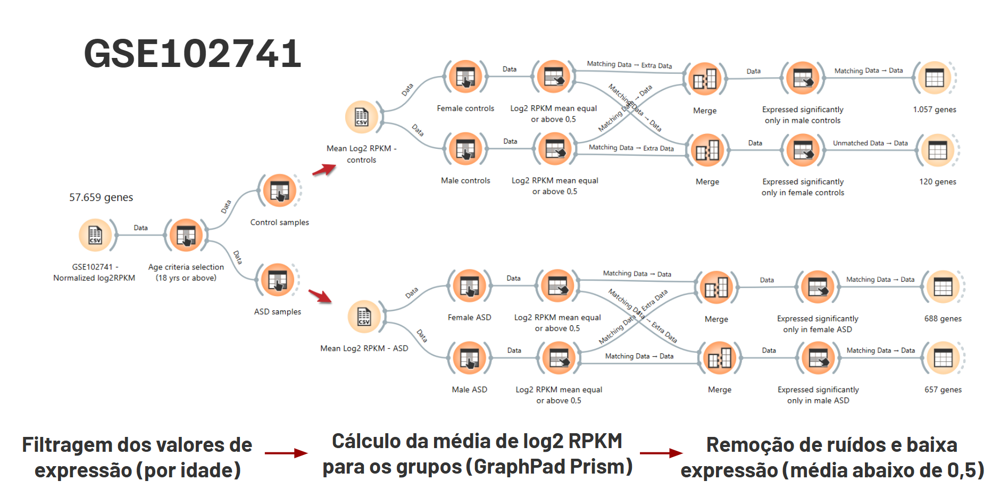

- Para a análise de expressão diferencial do dataset GSE102741, foram separados genes diferencialmente expressos em comum para os grupos TEA e controle, e genes diferencialmente expressos somente para o grupo TEA, como mostra o workflow abaixo.

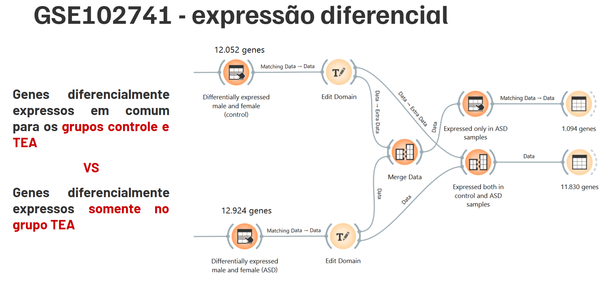

- Foram obtidos 4 grupos de análise:
    - Genes exclusivamente abundantes em grupos TEA (masculino e feminino)
    - Genes exclusivamente abundantes entre grupos específicos (TEA e Controle)
    - Genes diferencialmente expressos entre grupos com TEA (masculino e feminino)
    - Genes diferencialmente expressos entre todos os grupos (TEA e Controle)

- Já para o dataset E-MTAB-13871 foram separados para análise apenas os Genes diferencialmente expressos em todos os grupos (neurodivergentes vs neurotípicos).

### Análise do dataset GSE102741

- Para a representação dos dados em grafos, foi utilizada a ferramenta [Cytoscape](https://cytoscape.org/), com objetivo de visualizar os genes com maior abundância em indivíduos com TEA e entre ambos os grupos de análise (TEA e controle).

- A base [SFARI gene](https://gene.sfari.org/) foi utilizada como referência sobre genes relacionados ao autismo.

- As ferramentas [Genome Browser](https://genome.ucsc.edu/) e [GeneLoc](https://geneloc.weizmann.ac.il//index.shtml) foram utilizadas para a anotação de idiogramas.

- Foi realizada, também, uma análise de enriquecimento por meio da ferramentas [Enrichr](https://maayanlab.cloud/Enrichr/) e [David Bioinformatics](https://davidbioinformatics.nih.gov/), com objetivo de determinar os perfis funcionais, de localização e processuais exclusivos para os genes diferencialmente expressos associados ao TEA em indivíduos femininos e masculinos, identificando assim a divergência molecular por sexo.

- Os genes associados ao TEA, exclusivos femininos e exclusivos masculinos, obtidos nas etapas anteriores, foram submetidos ao [Enrichr](https://maayanlab.cloud/Enrichr/) para o teste de super-representação

- Para a análise e enriquecimento, a pesquisa foi focada nas três categorias principais da Gene Ontology (GO), utilizando a biblioteca mais recente para a espécie em estudo:
   - **GO Biological Process (BP)**: Processos e vias biológicas.
   - **GO Cellular Component (CC)**: Localização e estruturas celulares.
   - **GO Molecular Function (MF)**: Funções e atividades moleculares elementares.

- Por fim, foram realizadas as análises de expressão diferencial entre grupos com TEA (masculino e feminino) e entre todos os grupos (TEA e controle)

### Análise do dataset E-MTAB-13871

- Assim como no GSE102741, foram utilizadas as ferramentas [Cytoscape](https://cytoscape.org/) para representação em grafos, [SFARI gene](https://gene.sfari.org/) como referência e [Enrichr](https://maayanlab.cloud/Enrichr/) e [David Bioinformatics](https://davidbioinformatics.nih.gov/) para enriquecimento. 

- Assim como no GSE102741, foi realizada a análise de expressão diferencial para o caso entre todos os grupos (TEA e controle), seguida por uma análise de co-expressão entre cérebro (GSE102741) e sangue (E-MTAB-13871), comparando TEA e controle para os sexos masculino e feminino, e comparação entre TEA masculino e TEA feminino.

### Processamento e inclusão dos datasets GSE28521 e GSE18123

- De forma a acrescentar mais dados para as análises, foram incluídos junto aos dados do GSE102741 novos dados de sangue (GSE18123) e cérebro (GSE28521).

- Desta vez, optamos por não filtrar os indivíduos por idade, abrangindo todos os dados disponíveis.

- Para este processamento, foi utilizado o GEO2R de forma a visualizar plots dos dados, e o [Orange](https://orangedatamining.com/) para filtragem se ruído e significância.

- O workflow está mostrado na figura abaixo, com os filtros setados para log2FC maior que 0.7 e p-valor menor que 0.05

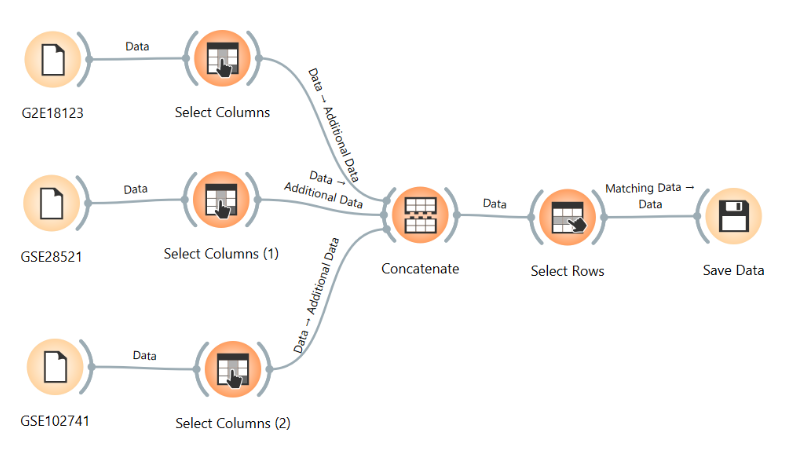

- Com isso, foi possível construir uma rede no [Cytoscape](https://cytoscape.org/) para análise e visualização dos dados.

## Evolução do Projeto

# Ferramentas

- [Orange](https://orangedatamining.com/)
- [GraphPad Prism](https://www.graphpad.com/features)
- [Cytoscape](https://cytoscape.org/)
- [SFARI gene](https://gene.sfari.org/)
- [AutDB](https://ngdc.cncb.ac.cn/databasecommons/database/id/3574)
- [Genome Browser](https://genome.ucsc.edu/)
- [GeneLoc](https://geneloc.weizmann.ac.il//index.shtml)
- [Enrichr](https://maayanlab.cloud/Enrichr/)
- [TargetMine](https://targetmine.mizuguchilab.org/)
- [David Bioinformatics](https://davidbioinformatics.nih.gov/)

# Resultados e Discussão

- Análise dos dados de autismo do SFARI

   - As proteínas associadas ao autismo tendem a se agrupar em três grandes redes funcionais:
    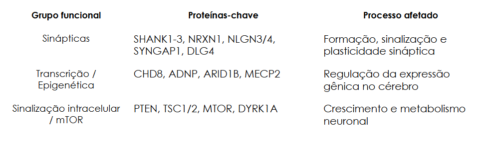

   - Quando analisamos os genes mais expressos no dataset do SFARI os 5 genes mais expressos, proteínas associadas e seu score incluem: 
    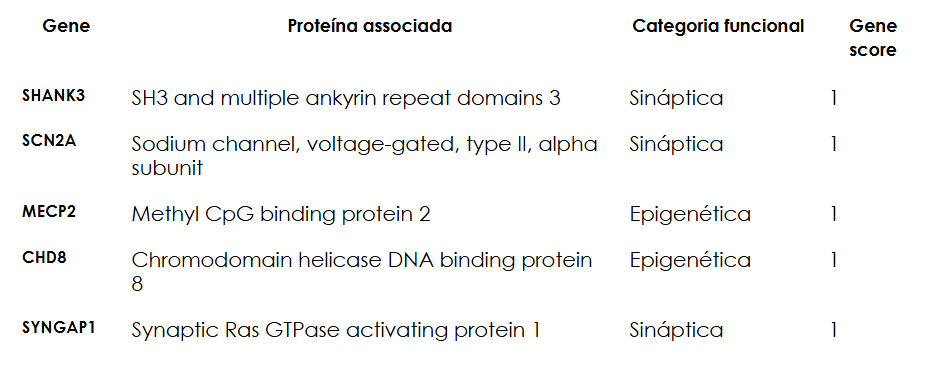
    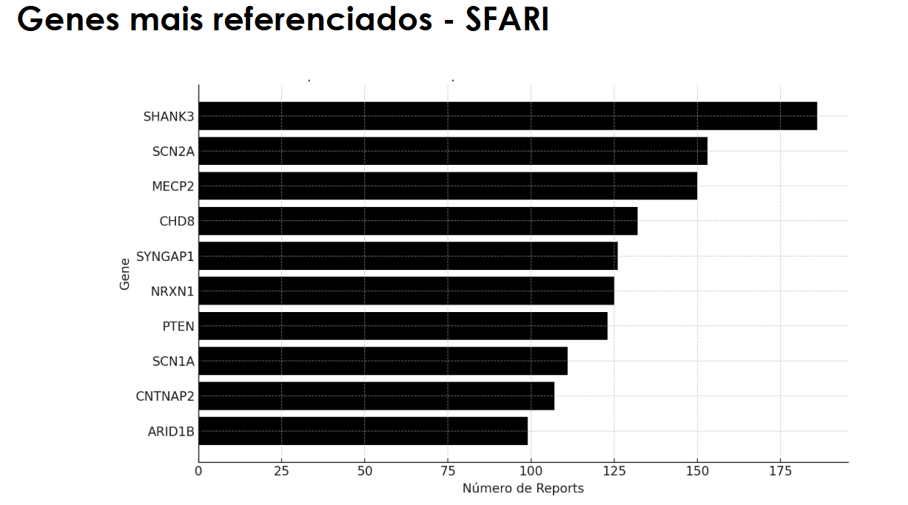

    - Ao analisar a distribuição de gene Score 1 por Cromossomo no SFARI, foi obtido o seguinte gráfico:
    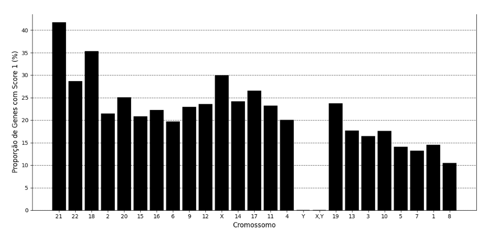

    - Os gene-scores por cromossomo mostram como os níveis de evidência dos genes variam em cada região do genoma. No gráfico é possível observar a proporção de genes com alta evidência científica (score 1) por cromossomo. Aqui novamente o cromossomo X aparece em destaque.

    - Ainda, quando observamos o boxplot da distribuição dos gene-scores por cromossomo, alguns cromossomos (como 7, 15, 17 e X) têm medianas mais baixas, indicando uma maior concentração de genes com forte evidência (score 1–2) de associação ao autismo
    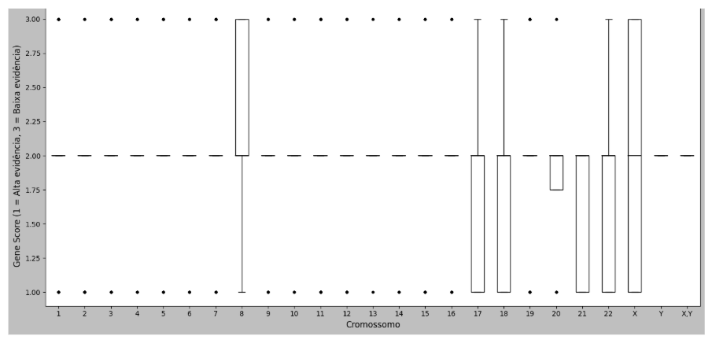

- Análises feitas para dados do cérebro ([GSE102741](https://www.ncbi.nlm.nih.gov/geo/query/acc.cgi?acc=GSE102741&utm))

    - Análise de abundância dos genes para o grupo com TEA
    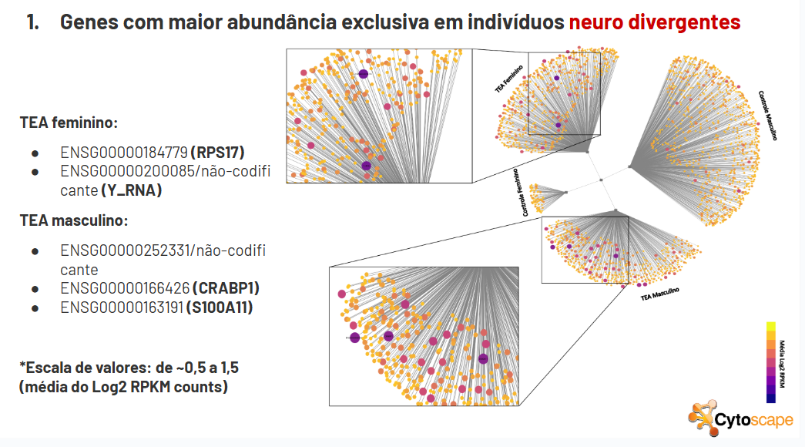
    
    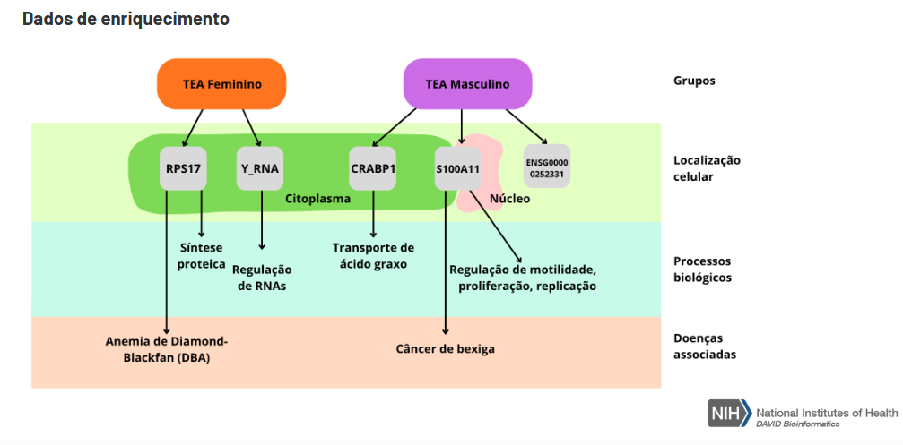

    - Análise de abundância dos genes para os grupos TEA e Controle
    
    
    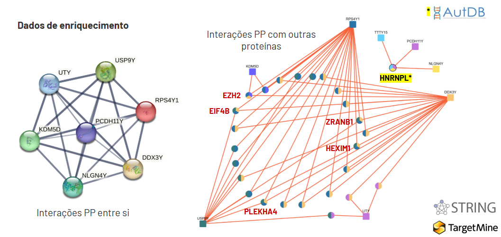

    - Análise de expressão diferencial para TEA e controle
    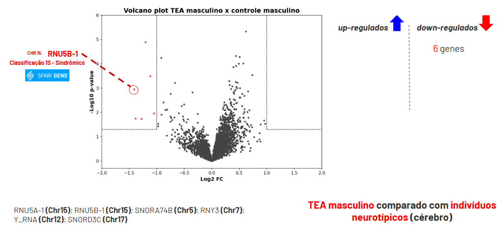
    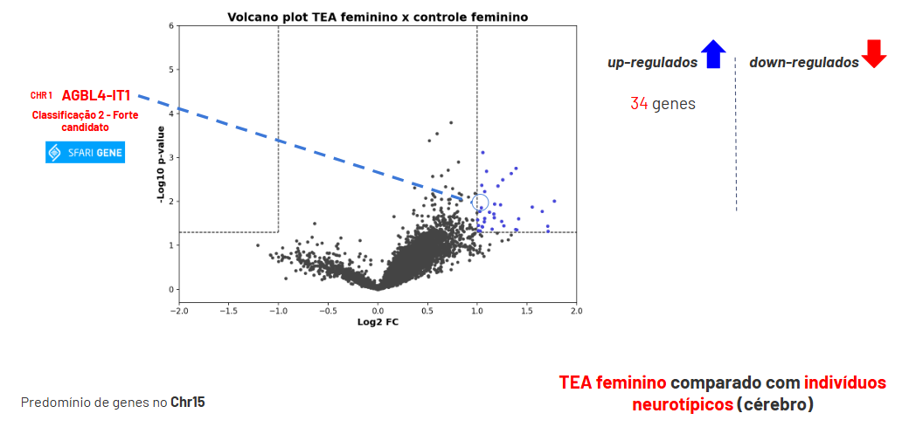
    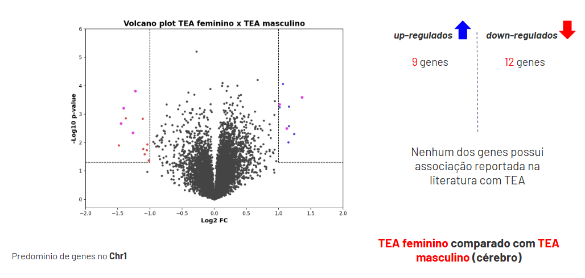

    - Análise de expressão diferencial para indivíduos com TEA
    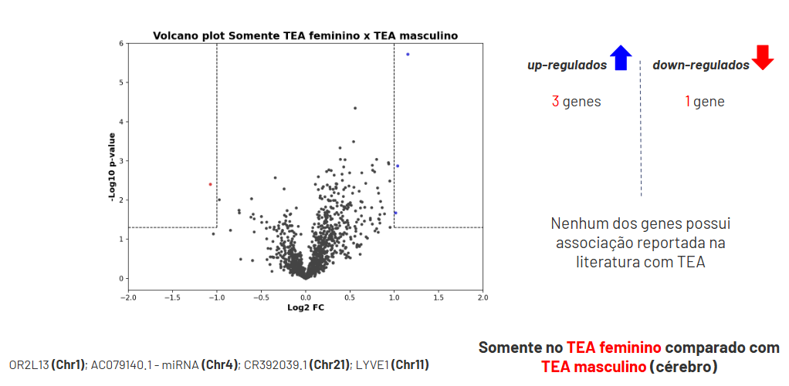

    - Rede de co-expressão obtida
    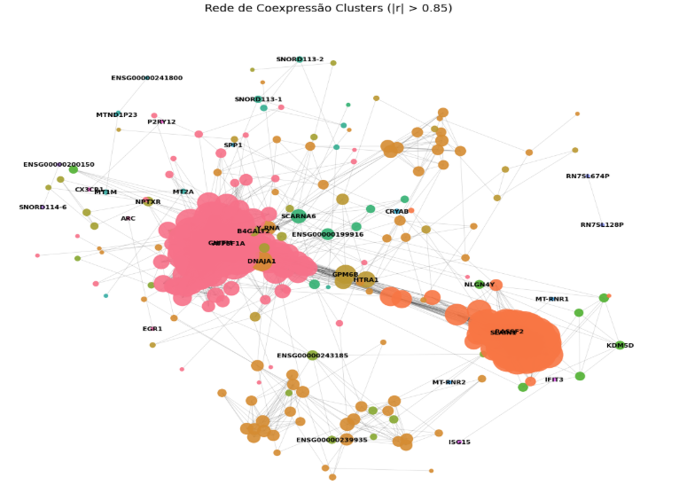

    - Rede de co-expressão para genes expressos em amostras TEA e controle
    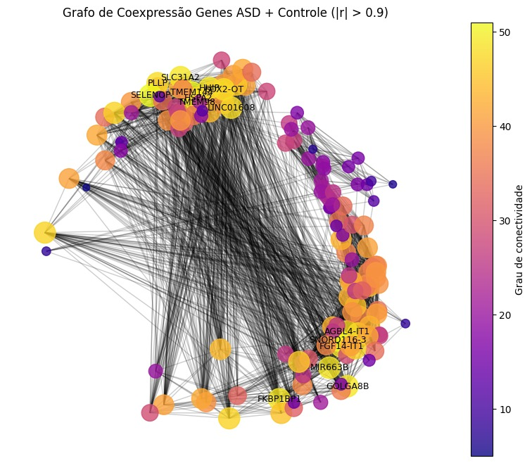

    - Rede de co-expressão para genes expressos somente em amostras TEA
    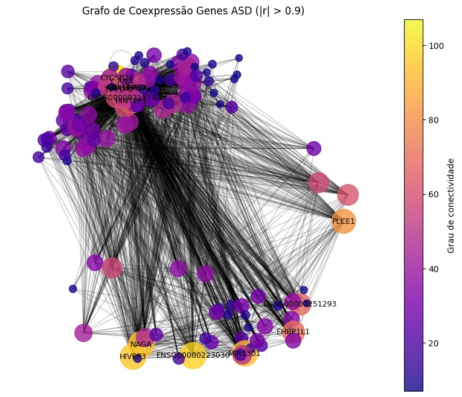

- Análise feita para dados de sangue ([E-MTAB-13871](https://www.omicsdi.org/dataset/biostudies-arrayexpress/E-MTAB-13871))

    - Análise de expressão diferencial para TEA e controle
    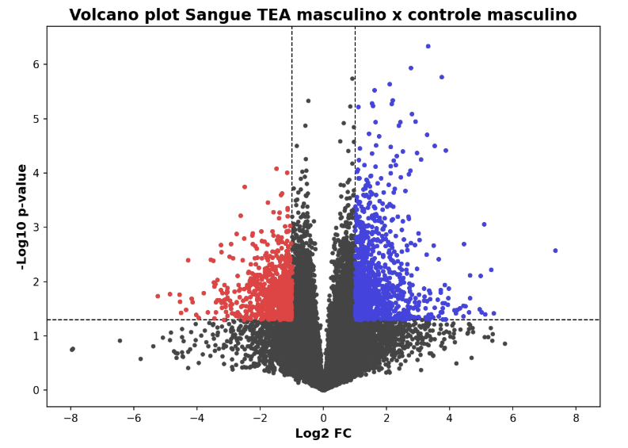
    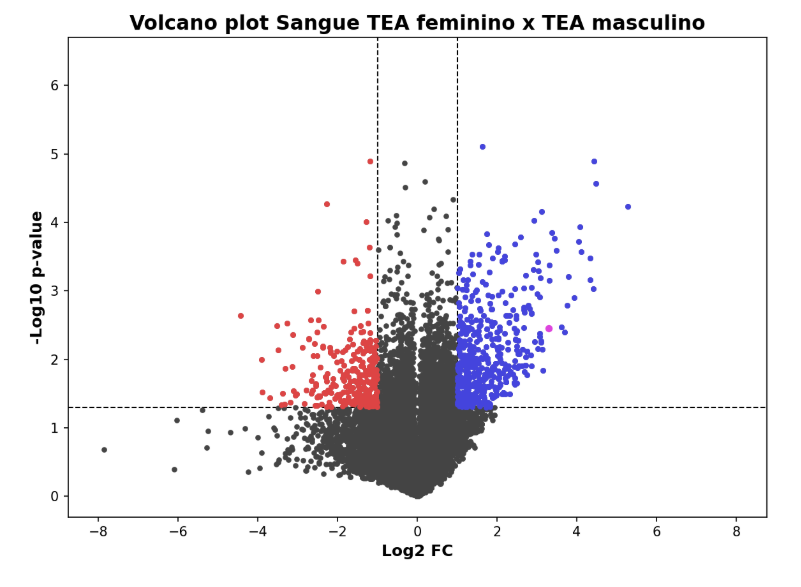

        - OBS: Devido ausência de replicatas biológicas entre os grupos TEA feminino e Controle feminino, a análise de significância estatística (p-valor) não pôde ser realizada. Os resultados reportados refletem apenas a magnitude da alteração (Log2 Fold Change) e não a confiança estatística.
    

- Análise de co-expressão entre cérebro e sangue
    - Controle vs TEA masculino
    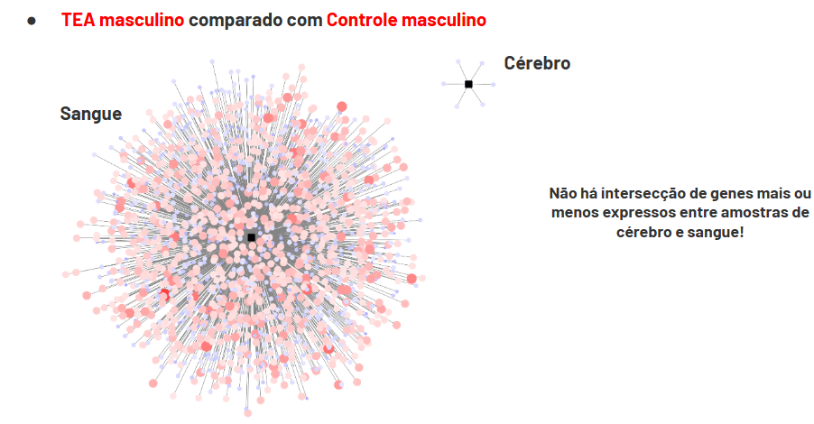

    - Controle vs TEA feminino
    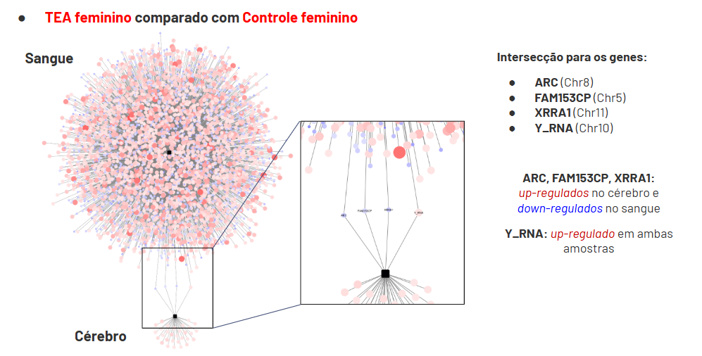
        - Para o caso feminino, o ARC é um biomarcador promissor. Ele participa de vias relacionadas ao autismo e outros processos de regulação sináptica em transtornos como esquizofrenia, estresse e ansiedade.
    
    - TEA feminino vs controle masculino
    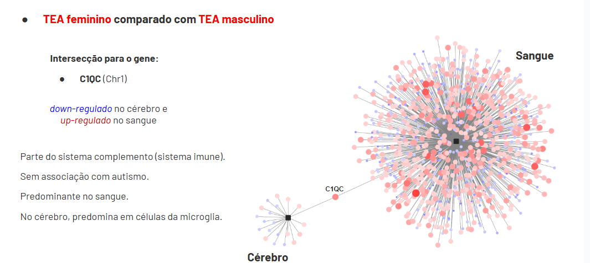

    - OBS: Para as redes mostradas, os nós representam os genes. O tamanho e coloração dos nós indicam a variação de log2 fold change. As arestas representam o tipo de amostra onde o gene foi identificado.

- Análise em conjuntos dos datasets [GSE102741](https://www.ncbi.nlm.nih.gov/geo/query/acc.cgi?acc=GSE102741&utm), [GSE28521](https://www.ncbi.nlm.nih.gov/geo/query/acc.cgi?acc=GSE28521) e [GSE18123](https://www.ncbi.nlm.nih.gov/geo/query/acc.cgi?acc=gse18123)

   - Volcano plots obtidos pelo GEO2R
   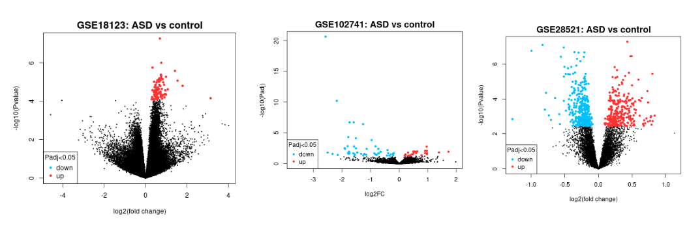

   - Rede resultante no Cytoscape após filtragem
   
     - A esquerda, estão os nós com tamanho proporcional à centralizade, e a direita a rede original.

   - Alguns resultados encontrados:
     - Foram encontrados alguns indícios de genes envolvidos em em resposta inflamatória e sinalização celular, que podem indicar aumento de inflamação e estresse celular em ASD (FOS, IL1B, CXCL8, CDKN1A), também genes expressos em neurônios GABAérgicos (inibitórios), que sugerem redução da atividade inibitória no cérebro em autistas (GAD1, GAD2, PVALB, SCN1B), ainda genesxpressos em micróglias/macrófagos, que estão relacionados à ativação imune cerebral e microgliose (CD14, CD163, C1QB, C1QC).
     - Vale destacar, também alguns genes fortemente positivos (ex: MALAT1, NEAT1, FMNL1, NEFH), super expressos no grupo autismo, ligados a neurônios, estrutura celular e regulação de RNA e outros fortemente negativos (ex: IL1B, CXCL8, C1QB, CD14, APOC1), reprimidos no autismo, associados à resposta imune, inflamação e microglia.

# Conclusão

- Com relação às perguntas de pesquisa:
    1. É possível identificar genes centrais e módulos de expressão que diferenciam amostras de neurodivergentes femininos e masculinos? É possível ampliar o escopo de comparação entre neurodivergentes e neurotípicos?

        Foi possível criar módulos ou grupos de análise a partir da filtragem dos dados. Os genes “centrais” para nossas redes, são aqueles que fazem intersecção entre módulos/grupos.

    2. A expressão destes genes centrais, se relaciona com a co-expressão de genes de hormonas sexuais regulados pelo eixo hipotálamo-hipófise de maneira diferencial?
        
        Não encontramos co-expressão de genes centrais identificados com genes de hormonas sexuais.
    
    3. Os genes centrais identificados aqui  já foram previamente associados ao TEA?

        Sim! Alguns dos genes centrais identificados já foram associados ao TEA! O que é um bom indicativo de correlação entre a expressão diferencial e a possibilidade de propô-lo como biomarcadores!
    
    4. Existe correlação entre os genes centrais identificados e a localização cromossomal em X e Y?

        Não. A localização dos genes centrais identificados não está enviesada para os cromossomos X e Y. Observamos uma alta frequência de genes centrais nos cromossomos 15  e 1. 
    
    5. Existe correlação entre os genes centrais identificados no cérebro e no sangue? É possível propô-los como biomarcadores?

        Sim! Encontramos duas intersecções, mas a mais interessante foi: ARC (para TEA feminino, comparado a indivíduos neurotípicos femininos). O fold change foi de pelo menos 2x, o que talvez já poderia ser um indicativo de um biomarcador para TEA feminino no sangue?*

- Com relação aos desafios enfrentados, vale destacar a dificuldade de lidar com os formatos de dados genéticos disponibilizados pelas bases, principalmente com relação a metadados.

# Trabalhos Futuros

- Mais estudos são necessários, com um maior número de amostras/replicatas de TEA feminino para avaliar a robustez estatística, o que acabou sendo uma limitação deste estudo.

# Referências Bibliográficas

- Gupta, A., & Bhat, A. (2019). Sex differences in autism spectrum disorder: Diagnostic, neurobiological and clinical aspects. Frontiers in Psychiatry, 10, 607. https://doi.org/10.3389/fpsyt.2019.00607

- Halladay, A. K., Bishop, S. L., Constantino, J. N., Daniels, A. M., Koenig, K., Palmer, K., Messinger, D., Pelphrey, K., Sanders, S. J., Singer, A. T., Taylor, J. L., & Szatmari, P. (2015). Sex and gender differences in autism spectrum disorder: summarizing evidence gaps and identifying emerging areas of priority. Molecular Autism, 6, 36. https://doi.org/10.1186/s13229-015-0019-y

- Lin L, et al. Integrated Analysis of Brain Transcriptome Reveals Convergent Molecular Pathways in Autism Spectrum Disorder. Front Psychiatry. 2019;10:706.
Napolitano, L., Ferri, R., & Di Filippo, G. (2022). Sex differences in autism spectrum disorder: diagnostic, neurobiological and clinical aspects. Frontiers in Psychiatry, 13, 889636. https://doi.org/10.3389/fpsyt.2022.889636 

- Voineagu, I., et al. (2011). Transcriptomic analysis of autistic brain reveals convergent molecular pathology. Nature, 474(7351), 380–384. https://doi.org/10.1038/nature10110 

- Willsey AJ, et al. Coexpression networks implicate human midfetal deep cortical projection neurons in the pathogenesis of autism. Cell. 2013;155(5):997–1007. PMID: 24138891 

- AMERICAN PSYCHIATRIC ASSOCIATION. Manual diagnóstico e estatístico de transtornos mentais: DSM-5. 5. ed. Porto Alegre: Artmed, 2014.

- ABRAHAM, Joseph R. et al. Proteomic Investigations of Autism Brain Identify Known and Novel Pathogenetic Processes. Scientific Reports, v. 9, n. 1, art. 13118, 11 sept. 2019. DOI: 10.1038/s41598-019-49533-y.

- BOURGERON, Thomas. From the genetic architecture to synaptic plasticity in autism spectrum disorder. Nature Reviews Neuroscience, v. 16, n. 9, p. 551–563, 2015. DOI: 10.1038/nrn3992.

- COSTA-MATTIOLI, Mauro; MONTEGGIA, Lisa M. mTOR complexes in neurodevelopmental and neuropsychiatric disorders. Nature Neuroscience, v. 16, n. 11, p. 1537–1543, 2013. DOI: 10.1038/nn.3546.

- LIU, Wenlong et al. Integration of Urine Proteomic and Metabolomic Profiling Reveals Novel Insights Into Neuroinflammation in Autism Spectrum Disorder. Frontiers in Psychiatry, v. 13, 2022. DOI: 10.3389/fpsyt.2022.780747.

- KONG, Sek Won et al. Characteristics and predictive value of blood transcriptome signature in males with autism spectrum disorders. PLoS ONE, v. 7, n. 12, e49475, dez. 2012. DOI: 10.1371/journal.pone.0049475.

- PARIKSHAK, Neelroop N.; GANDAL, Michael J.; GESCHWIND, Daniel H. Systems biology and gene networks in neurodevelopmental and neurodegenerative disorders. Nature Reviews Genetics, v. 16, p. 441–458, 2015. DOI: 10.1038/nrg3934.

